# Cerina Protocol Foundry - Architecture Diagram

## System Architecture Overview


## Detailed Flow Descriptions

### 1. React UI Flow (Human-in-the-Loop)


### 2. MCP Server Flow (Machine-to-Machine)


### 3. Agent Decision Flow

```mermaid
graph TD
    Start([New Protocol Request])
    Start --> Supervisor1[Supervisor: Check State]
    
    Supervisor1 --> CheckRevision{needs_revision<br/>flag set?}
    CheckRevision -->|Yes| Drafter1[Drafter: Incorporate<br/>human feedback]
    CheckRevision -->|No| CheckDraft{Has draft?}
    
    CheckDraft -->|No| Drafter2[Drafter: Create<br/>initial draft]
    CheckDraft -->|Yes| CheckSafety{Safety<br/>assessed?}
    
    Drafter1 --> Supervisor2[Supervisor]
    Drafter2 --> Supervisor2
    
    CheckSafety -->|No| Safety1[Safety Guardian:<br/>Analyze risks]
    CheckSafety -->|Yes| CheckClinical{Clinical<br/>assessed?}
    
    Safety1 --> Supervisor3[Supervisor]
    
    CheckClinical -->|No| Clinical1[Clinical Critic:<br/>Score quality]
    CheckClinical -->|Yes| CheckQuality{Quality ≥ 8.0?}
    
    Clinical1 --> Supervisor4[Supervisor]
    
    CheckQuality -->|No| Drafter3[Drafter: Improve<br/>based on feedback]
    CheckQuality -->|Yes| HumanNode[Human Approval Node:<br/>INTERRUPT]
    
    Drafter3 --> Supervisor5[Supervisor]
    Supervisor2 --> CheckSafety
    Supervisor3 --> CheckClinical
    Supervisor4 --> CheckQuality
    Supervisor5 --> CheckSafety
    
    HumanNode --> WaitDB[(Save to DB<br/>Wait for human)]
    WaitDB --> HumanDecision{Human Decision}
    
    HumanDecision -->|Approve| Complete([Save Final Protocol])
    HumanDecision -->|Revise| SetFlag[Set needs_revision=true<br/>Store feedback]
    SetFlag --> Supervisor6[Supervisor]
    Supervisor6 --> CheckRevision
    
    style Start fill:#90EE90
    style Complete fill:#FFD700
    style HumanNode fill:#FF6B6B
    style WaitDB fill:#87CEEB
```



## Key Architectural Decisions

### 1. **Supervisor-Worker Pattern**
- **Supervisor Agent**: Central orchestrator that makes routing decisions
- **Worker Agents**: Specialized agents (Drafter, Safety, Clinical) that execute tasks
- **Advantages**: Clear separation of concerns, flexible routing, easy to add new agents

### 2. **Shared State (Blackboard Pattern)**
- All agents read/write to a centralized `ProtocolState`
- Enables rich communication via scratchpad notes
- Tracks versions, iterations, and metadata
- Immutable history through checkpoint system

### 3. **Interrupt-Based Human-in-the-Loop**
- Graph pauses at `interrupt_before=["human_approval"]`
- State persisted to PostgreSQL checkpoint
- Frontend polls for state updates
- Resume execution after human feedback

### 4. **Dual Interface Architecture**
- **React UI**: Visual, human-centric, real-time agent monitoring
- **MCP Server**: Programmatic, machine-centric, tool-based access
- Both use the same LangGraph workflow core

### 5. **Persistence Strategy**
- PostgreSQL with sync `PostgresSaver`
- Checkpoints saved after every agent execution
- Crash-recovery capable
- Thread-based isolation via `thread_id`

## Technology Stack

| Layer | Technology | Purpose |
|-------|-----------|---------|
| Frontend | React 19.2 + TypeScript | User interface with real-time updates |
| API | FastAPI 0.110+ | REST endpoints, WebSocket support |
| Workflow | LangGraph 0.2+ | Agent orchestration, state management |
| Agents | LangChain + OpenAI | LLM-powered reasoning and generation |
| MCP | mcp-python 0.9+ | Model Context Protocol server |
| Database | PostgreSQL | Persistent checkpointing and history |
| Dev Server | Vite 7.2 | Fast frontend development |
| Server | Uvicorn | ASGI server for FastAPI |

## State Flow Example

```python
# Initial State
{
    "user_intent": "Create exposure hierarchy for agoraphobia",
    "current_draft": None,
    "iteration_count": 0,
    "needs_revision": False
}

# After Drafter (Iteration 1)
{
    "current_draft": "Step 1: Practice looking at photos...",
    "draft_versions": [{"version": 1, "text": "..."}],
    "scratchpad": "Drafter: Created initial 5-step hierarchy",
    "iteration_count": 1
}

# After Safety Guardian
{
    "safety_assessment": {
        "level": "safe",
        "concerns": [],
        "recommendations": []
    },
    "scratchpad": "Drafter: Created initial 5-step hierarchy\nSafety: No risks detected"
}

# After Clinical Critic
{
    "clinical_assessment": {
        "empathy_score": 9.0,
        "structure_score": 9.0,
        "clinical_appropriateness": 9.5,
        "feedback": "Excellent progression, empathetic tone"
    },
    "scratchpad": "...\nClinical: High quality, approved for human review"
}

# At Human Approval (INTERRUPTED)
{
    "requires_human_approval": True,
    "human_approved": None,
    # Graph paused, state saved to PostgreSQL
}

# After Human Revision Request
{
    "needs_revision": True,
    "revision_reason": "Add more detail to step 3",
    "human_approved": False,
    "iteration_count": 2  # Will increment on next Drafter run
}

# Final State (After Approval)
{
    "human_approved": True,
    "completed": True,
    "final_protocol": "...",
    "iteration_count": 3
}
```

## Rendering Instructions

To generate the architecture diagram image:

### Option 1: Using Mermaid Live Editor (Recommended)
1. Visit https://mermaid.live/
2. Copy the first mermaid diagram from this file
3. Paste it into the editor
4. Click "Download PNG" or "Download SVG"

### Option 2: Using GitHub
1. Create a new file `architecture.md` in your repository
2. Paste the mermaid diagram code
3. GitHub will automatically render it
4. Take a screenshot

### Option 3: Using VS Code
1. Install "Markdown Preview Mermaid Support" extension
2. Open this file in VS Code
3. Use Preview (Cmd+Shift+V)
4. Right-click diagram → Copy as PNG

### Option 4: Using CLI
```bash
npm install -g @mermaid-js/mermaid-cli
mmdc -i ARCHITECTURE_DIAGRAM.md -o architecture.png
```

## System Metrics

- **Total Agents**: 4 (Supervisor, Drafter, Safety Guardian, Clinical Critic)
- **API Endpoints**: 4 (POST /protocols, GET /state, POST /feedback, GET /health)
- **Database Tables**: 2 (checkpoints, checkpoint_writes)
- **State Fields**: 19 (comprehensive tracking)
- **Average Iterations**: 3-5 per protocol
- **Resume Capability**: 100% (checkpoint after every node)
